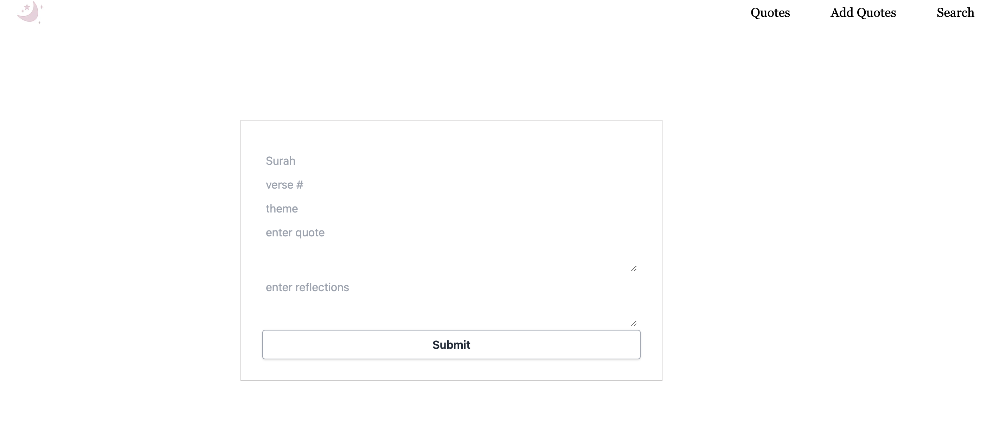

The content below is an example project proposal / requirements document. Replace the text below the lines marked "**TODO**" with details specific to your project. Remove the "TODO" lines.

(**TODO**: final project)

# Qur’ānic Reflections

## Overview

(**TODO**: a brief one or two paragraph, high-level description of your project)

When reading the Qur'an, it is important to ponder the verses and reflect on their meaning, interpretations, and how they make the reader feel/think.

Qur'anic Reflections is a web app that will allow users to dd verses from the Qur'an that are important to them, search for specific quotes, and write their reflections on chosen verses.

## Data Model

(**TODO**: a description of your application's data and their relationships to each other)

The application will store Users, Quotes, and Reflections

- users can have multiple quotes (by references) and a reflection (via embedding)

(**TODO**: sample documents)

An Example User with quotes referenced:

```javascript
{
  username: "user",
  quotes: [], //reference

}
```

An Example Reflections:

```javascript
{
  text:
  createdAt:
}
```

An Example Quotes with reflections embedded:

```javascript
{
  surah: " ",
  verseNo: " ",
  themes: []
  reflections: // embedded
}
```

## [Link to Commented First Draft Schema](db.mjs)

(**TODO**: create a first draft of your Schemas in db.mjs and link to it)

## Wireframes

(**TODO**: wireframes for all of the pages on your site; they can be as simple as photos of drawings or you can use a tool like Balsamiq, Omnigraffle, etc.)

/quotes-add - start page to add quotes



/quotes - page for showing all quotes


/quotes-search - page for searching a specific quote


## Site map

(**TODO**: draw out a site map that shows how pages are related to each other)


## User Stories or Use Cases

(**TODO**: write out how your application will be used through [user stories](http://en.wikipedia.org/wiki/User_story#Format) and / or [use cases](https://en.wikipedia.org/wiki/Use_case))

1. as a user, I can view all the quotes
2. as a user, I can add new quotes with reflections
3. as a user, I can search for quotes

## Research Topics

(**TODO**: the research topics that you're planning on working on along with their point values... and the total points of research topics listed)

- (6 points) Use a front-end framework
  - I will be using Next.js
- (2 points) Use a CSS framework or UI toolkit

  - I will be using Tailwind CSS

  - (2 points) Integrate ESLint into your workflow

10 points total out of 10 required points (**\_TODO**: addtional points will **not** count for extra credit)

## Annotations / References Used

(**TODO**: list any tutorials/references/etc. that you've based your code off of)

1. [tailwind css](https://tailwindcss.com/docs/guides/nextjs) - (add link to source code that was based on this)
2. [tutorial on next.js](https://nextjs.org/docs/pages/api-reference/create-next-app) - (add link to source code that was based on this)
3. [next.js with mongoose](https://github.com/vercel/next.js/tree/canary/examples/with-mongodb-mongoose) - (add link to source code that was based on this)
